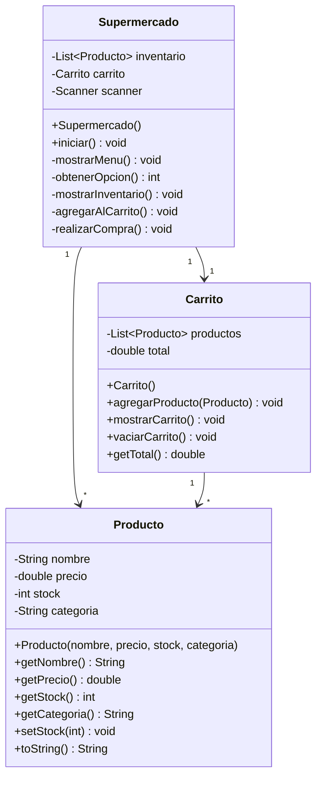
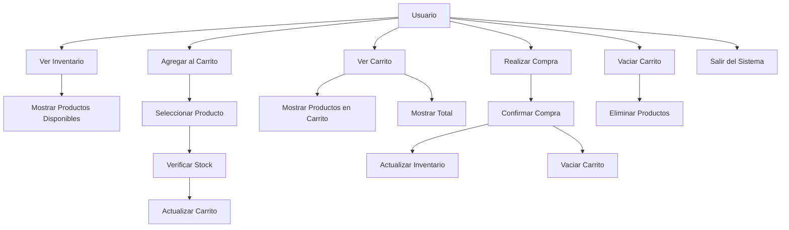
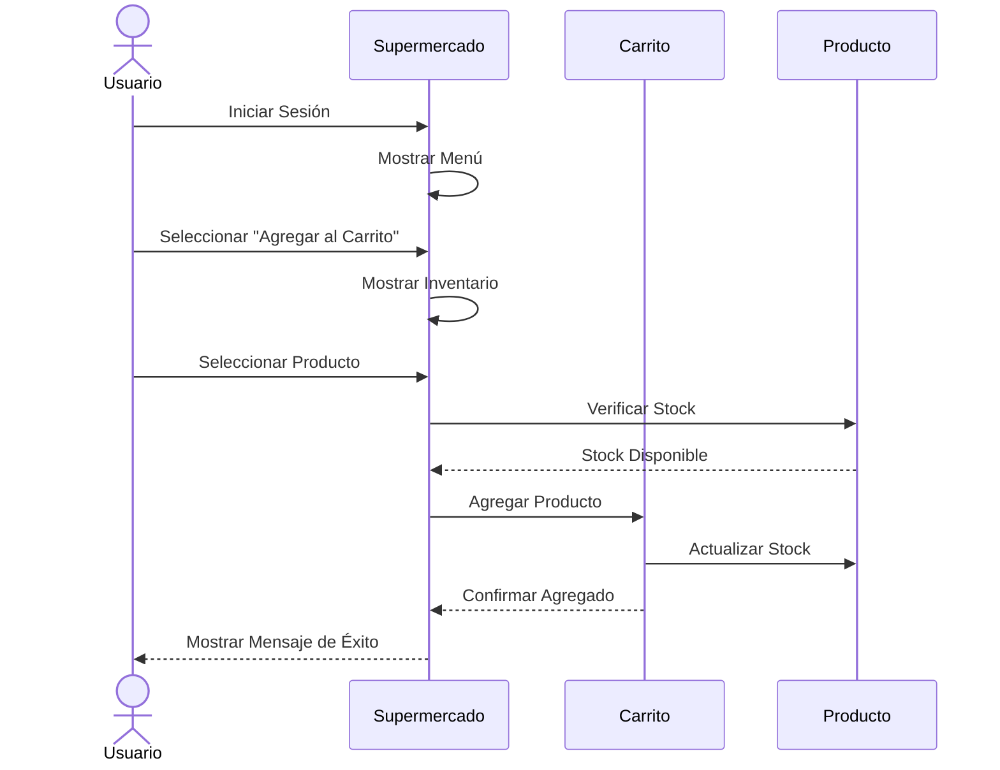
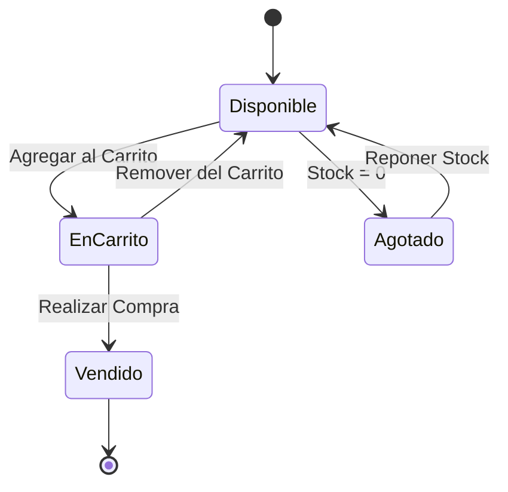
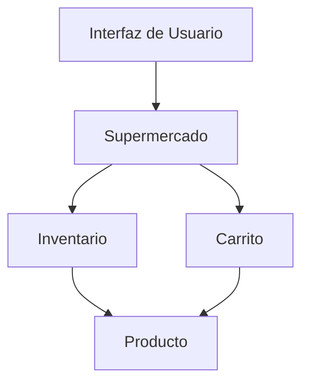
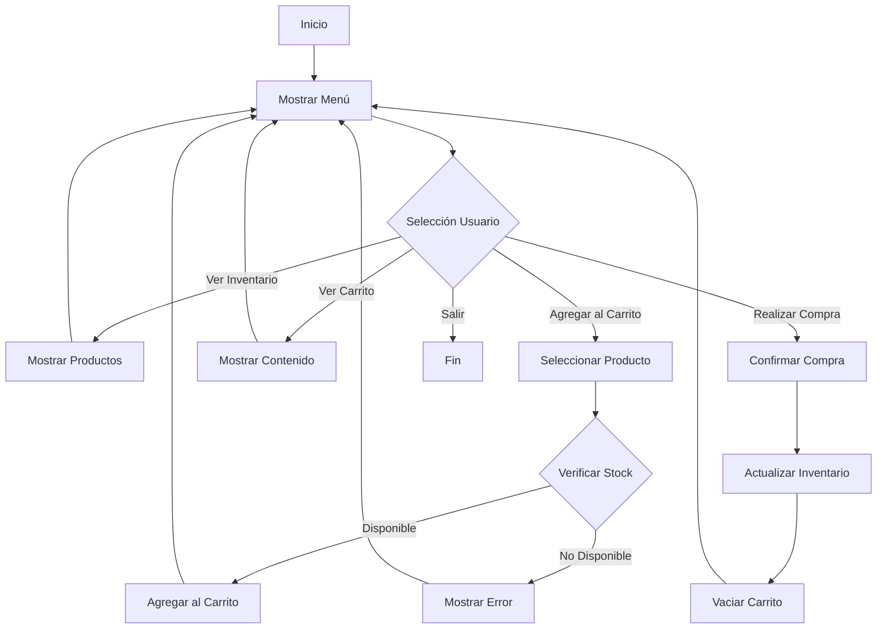

# Diagramas UML - Supermercado Virtual

## Diagrama de Clases

## Diagrama de Casos de Uso

## Diagrama de Secuencia - Proceso de Compra

## Diagrama de Estados - Producto

## Diagrama de Componentes

## Diagrama de Actividad - Proceso de Compra

