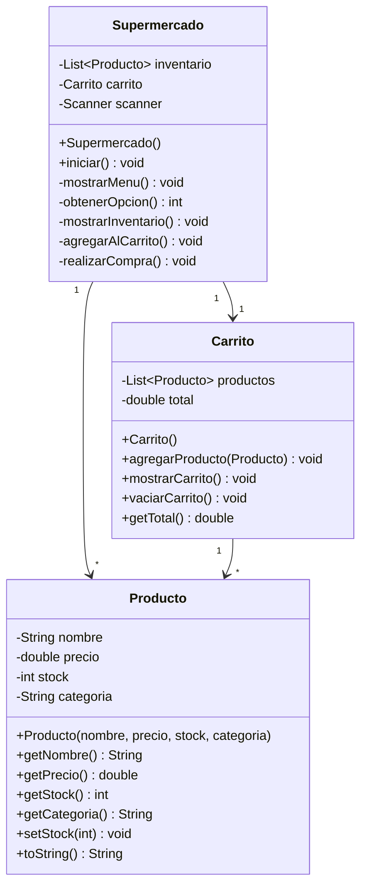
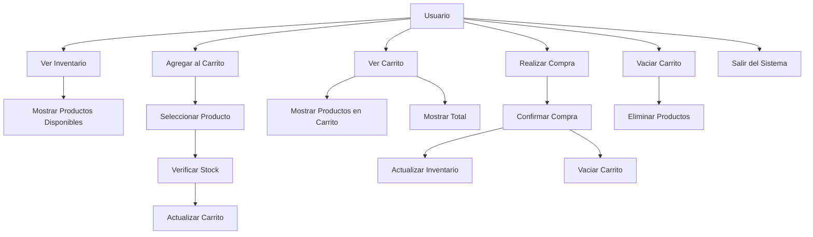

# SUPERMERCADO VIRTUAL
## Sistema de Gestión de Compras en Línea

---

## Portada

**Título del Proyecto:**  
Supermercado Virtual - Sistema de Gestión de Compras en Línea

**Integrantes del Equipo:**
- Daniel Leandro Ascanio (192468) - Diseñador y Analista
- Shary Torcoroma Jimenez (192467) - Analista y Documentadora
- Angie Daniela Ramirez (192491) - Desarrolladora
- Harol Camilo Melo (192471) - Desarrollador y tester

**Fecha de Entrega:**  
13 de Junio de 2025

---

## Introducción

### Contexto del Problema
En la actualidad, la digitalización de los procesos de compra se ha vuelto fundamental para mejorar la experiencia del usuario y optimizar la gestión de inventarios. El proyecto "Supermercado Virtual" surge como una solución para simular un sistema de compras en línea, permitiendo a los usuarios interactuar con un catálogo de productos, gestionar un carrito de compras y realizar transacciones de manera eficiente.

### Objetivos
1. **Desarrollar un sistema de gestión de compras en línea mediante interfaz de consola**
   - Crear una interfaz intuitiva y fácil de usar
   - Implementar un sistema de navegación claro
   - Asegurar la usabilidad del sistema

2. **Implementar un sistema robusto de gestión de inventario**
   - Control de stock en tiempo real
   - Validación de disponibilidad de productos
   - Actualización automática del inventario

3. **Crear una experiencia de usuario intuitiva y amigable**
   - Interfaz clara y organizada
   - Mensajes informativos y de error claros
   - Flujo de compra simplificado

4. **Asegurar la integridad de los datos y transacciones**
   - Validación de operaciones
   - Control de errores
   - Prevención de pérdida de datos

5. **Facilitar el proceso de compra para los usuarios**
   - Proceso de compra simplificado
   - Información clara de precios y totales
   - Confirmación de operaciones

### Alcance del Proyecto
El sistema permite:

1. **Gestión de Productos**
   - Visualización del catálogo completo
   - Información detallada de cada producto
   - Control de stock en tiempo real

2. **Gestión del Carrito**
   - Agregar productos
   - Ver contenido actual
   - Calcular totales
   - Vaciar carrito

3. **Proceso de Compra**
   - Selección de productos
   - Verificación de stock
   - Confirmación de compra
   - Actualización de inventario

4. **Interfaz de Usuario**
   - Menú principal intuitivo
   - Navegación sencilla
   - Mensajes claros y concisos

---

## Documentación Técnica

### Módulos Desarrollados

#### 1. Módulo de Productos (`Producto.java`)
- **Responsabilidad:** Gestión de la información de productos
- **Funcionalidades:**
  - Almacenamiento de datos del producto
    - Nombre del producto
    - Precio unitario
    - Cantidad en stock
    - Categoría
  - Control de stock
    - Verificación de disponibilidad
    - Actualización de cantidad
  - Formateo de información
    - Presentación clara de datos
    - Formato de precios
    - Información de stock

#### 2. Módulo de Carrito (`Carrito.java`)
- **Responsabilidad:** Gestión del carrito de compras
- **Funcionalidades:**
  - Agregar productos
    - Validación de stock
    - Actualización de total
    - Mensajes de confirmación
  - Mostrar contenido
    - Lista de productos
    - Precios individuales
    - Total de la compra
  - Calcular totales
    - Suma de precios
    - Formato de moneda
  - Vaciar carrito
    - Eliminación de productos
    - Restauración de stock
    - Reinicio de total

#### 3. Módulo Principal (`Supermercado.java`)
- **Responsabilidad:** Coordinación del sistema
- **Funcionalidades:**
  - Gestión de inventario
    - Lista de productos
    - Control de stock
    - Actualización de datos
  - Interfaz de usuario
    - Menú principal
    - Navegación
    - Mensajes al usuario
  - Control de flujo
    - Validación de opciones
    - Manejo de errores
    - Control de sesión
  - Validación de operaciones
    - Verificación de datos
    - Control de excepciones
    - Mensajes de error

### Tecnologías Empleadas

1. **Lenguaje de Programación:**
   - Java SE (Standard Edition)
   - Versión: 8 o superior
   - Características utilizadas:
     - Programación Orientada a Objetos
     - Colecciones de Java
     - Manejo de excepciones
     - Entrada/Salida estándar

2. **Herramientas de Desarrollo:**
   - IDE: IntelliJ IDEA / Eclipse / VS Code
     - Depuración integrada
     - Autocompletado
     - Refactorización
   - Control de Versiones: Git
     - Control de cambios
     - Colaboración en equipo
   - Documentación: Markdown
     - Formato legible
     - Fácil de mantener

3. **Librerías y Frameworks:**
   - Java Collections Framework
     - ArrayList para inventario
     - List para productos
   - Java I/O
     - Scanner para entrada
     - System.out para salida
   - Java Util
     - Formateo de strings
     - Manejo de números

### Justificación de Decisiones Técnicas

1. **Elección de Java:**
   - **Robustez y portabilidad**
     - Código compilado a bytecode
     - Ejecutable en cualquier plataforma
   - **Amplio soporte y documentación**
     - Gran comunidad de desarrolladores
     - Documentación extensa
   - **Facilidad para aplicaciones de consola**
     - APIs nativas para I/O
     - Manejo simple de entrada/salida
   - **Orientación a objetos pura**
     - Encapsulamiento
     - Herencia
     - Polimorfismo

2. **Estructura Modular:**
   - **Facilita el mantenimiento**
     - Código organizado
     - Responsabilidades claras
   - **Permite la escalabilidad**
     - Fácil adición de funcionalidades
     - Módulos independientes
   - **Mejora la reutilización**
     - Componentes reutilizables
     - Código limpio
   - **Separa responsabilidades**
     - Cada clase tiene un propósito
     - Bajo acoplamiento

3. **Interfaz de Consola:**
   - **Simplicidad en la implementación**
     - Desarrollo rápido
     - Menos complejidad
   - **Fácil de probar**
     - Pruebas automatizadas
     - Depuración sencilla
   - **Sin dependencias externas**
     - Instalación simple
     - Menos puntos de fallo
   - **Ideal para demostración**
     - Fácil de entender
     - Enfoque en la lógica

---

## SDLC (Software Development Life Cycle)

### 1. Planificación
- **Definición de requerimientos**
  - Análisis de necesidades
  - Especificación de funcionalidades
  - Priorización de tareas
- **Establecimiento de objetivos**
  - Metas claras
  - Criterios de éxito
  - Timeline del proyecto
- **Asignación de roles**
  - Responsabilidades específicas
  - Coordinación del equipo
  - Comunicación efectiva
- **Creación de cronograma**
  - Fechas de entrega
  - Hitos del proyecto
  - Recursos necesarios

### 2. Análisis
- **Estudio de requerimientos**
  - Documentación detallada
  - Casos de uso
  - Restricciones del sistema
- **Identificación de casos de uso**
  - Flujos principales
  - Flujos alternativos
  - Excepciones
- **Definición de clases y relaciones**
  - Modelo de datos
  - Interacciones
  - Dependencias
- **Análisis de viabilidad**
  - Recursos disponibles
  - Tiempo estimado
  - Riesgos potenciales

### 3. Diseño
- **Creación de diagramas UML**
  - Diagrama de clases
  - Diagrama de casos de uso
  - Diagrama de secuencia
- **Diseño de la arquitectura**
  - Estructura del sistema
  - Patrones de diseño
  - Interfaces
- **Definición de interfaces**
  - Contratos de clases
  - Métodos públicos
  - Validaciones
- **Planificación de la base de datos**
  - Estructura de datos
  - Persistencia
  - Consultas

### 4. Implementación
- **Desarrollo de clases**
  - Código fuente
  - Documentación interna
  - Comentarios
- **Implementación de funcionalidades**
  - Lógica de negocio
  - Validaciones
  - Manejo de errores
- **Integración de módulos**
  - Pruebas de integración
  - Resolución de conflictos
  - Optimización
- **Pruebas unitarias**
  - Cobertura de código
  - Casos de prueba
  - Corrección de errores

### 5. Pruebas
- **Pruebas de integración**
  - Interacción entre módulos
  - Flujos completos
  - Escenarios reales
- **Pruebas de sistema**
  - Funcionalidad completa
  - Rendimiento
  - Estabilidad
- **Pruebas de aceptación**
  - Requerimientos cumplidos
  - Usabilidad
  - Experiencia de usuario
- **Corrección de errores**
  - Identificación de bugs
  - Solución de problemas
  - Verificación de correcciones

### 6. Mantenimiento
- **Documentación del código**
  - Comentarios
  - Guías de usuario
  - Manual técnico
- **Optimización de rendimiento**
  - Análisis de código
  - Mejoras de eficiencia
  - Refactorización
- **Corrección de bugs**
  - Monitoreo
  - Reportes de errores
  - Actualizaciones
- **Mejoras continuas**
  - Nuevas funcionalidades
  - Actualizaciones
  - Mejoras de usabilidad

---

## Diagramas UML

### Diagrama de Clases


### Diagrama de Casos de Uso


---

## Conclusión

El proyecto "Supermercado Virtual" demuestra la implementación exitosa de un sistema de gestión de compras en línea, utilizando Java como lenguaje principal y siguiendo las mejores prácticas de desarrollo de software. El sistema cumple con todos los objetivos establecidos y proporciona una base sólida para futuras mejoras y expansiones.

### Logros Principales
1. Sistema funcional y robusto
2. Código bien estructurado y mantenible
3. Documentación completa y clara
4. Interfaz de usuario intuitiva

### Aprendizajes
1. Aplicación de conceptos OOP
2. Gestión de proyectos en equipo
3. Documentación técnica
4. Control de versiones

### Próximos Pasos
1. Implementación de persistencia de datos
2. Mejoras en la interfaz de usuario
3. Nuevas funcionalidades
4. Optimización de rendimiento

---

## Anexos

### A. Instrucciones de Instalación
1. **Requisitos:**
   - Java JDK 8 o superior
   - IDE compatible con Java
   - Sistema operativo: Windows/Linux/MacOS

2. **Compilación:**
   ```bash
   javac -d bin src/*.java
   ```

3. **Ejecución:**
   ```bash
   java -cp bin Supermercado
   ```

### B. Guía de Usuario
1. **Ver Inventario (Opción 1)**
   - Muestra todos los productos disponibles
   - Incluye precios y stock
   - Formato claro y organizado

2. **Agregar al Carrito (Opción 2)**
   - Seleccionar producto por número
   - Verificar disponibilidad
   - Confirmación de agregado

3. **Ver Carrito (Opción 3)**
   - Lista de productos seleccionados
   - Precios individuales
   - Total de la compra

4. **Realizar Compra (Opción 4)**
   - Confirmación de compra
   - Actualización de inventario
   - Mensaje de éxito

5. **Vaciar Carrito (Opción 5)**
   - Eliminar todos los productos
   - Restaurar stock
   - Reiniciar total

6. **Salir (Opción 6)**
   - Cierre seguro del programa
   - Mensaje de despedida 