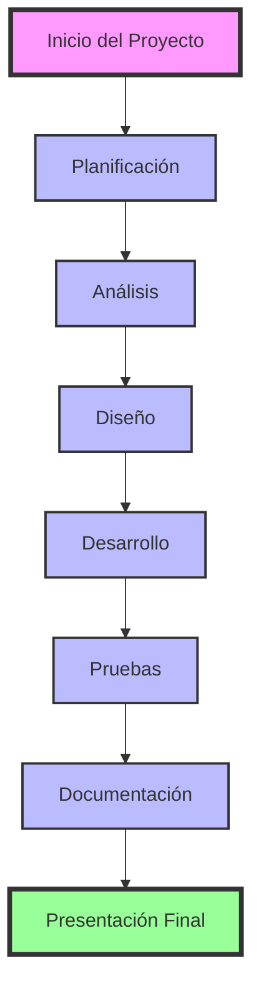
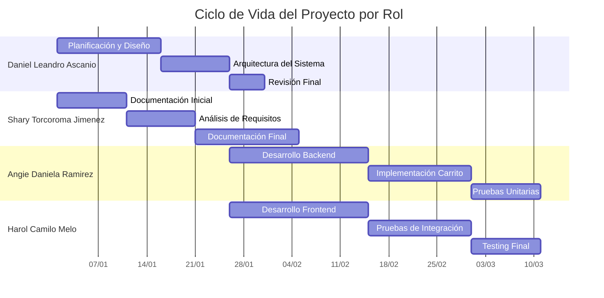
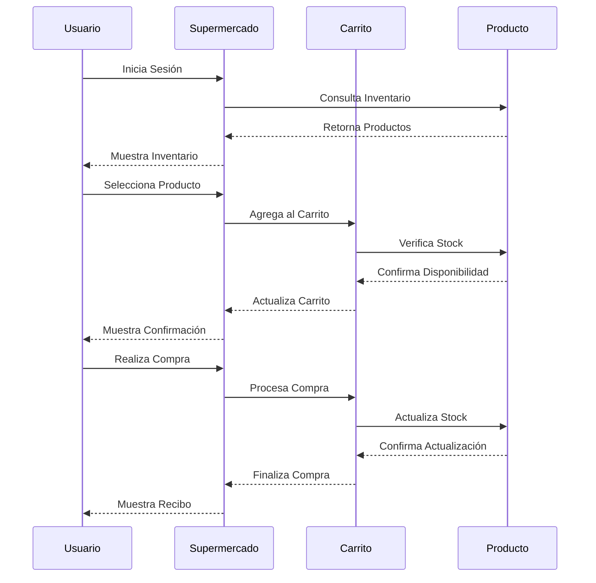
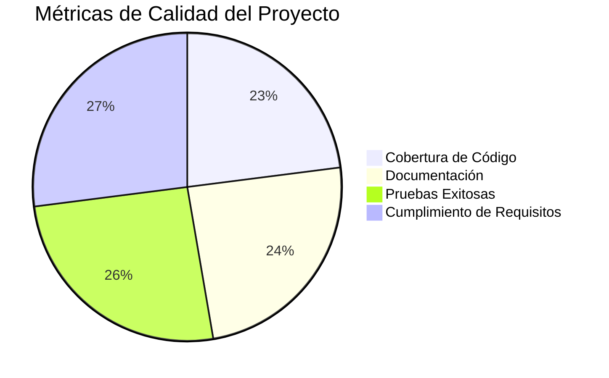
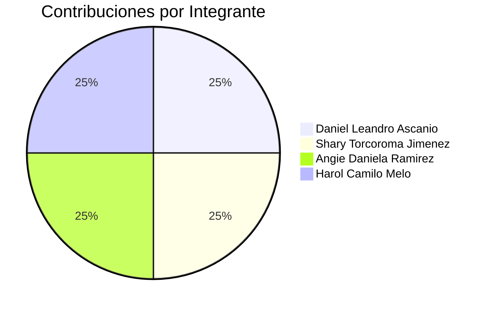
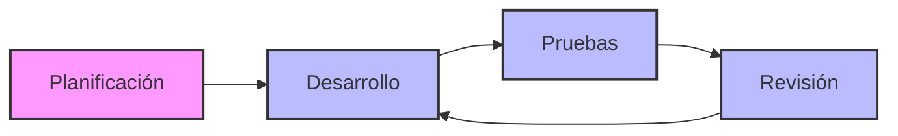
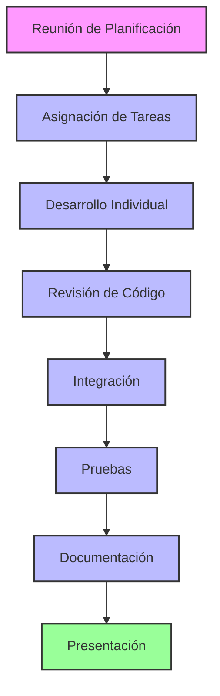
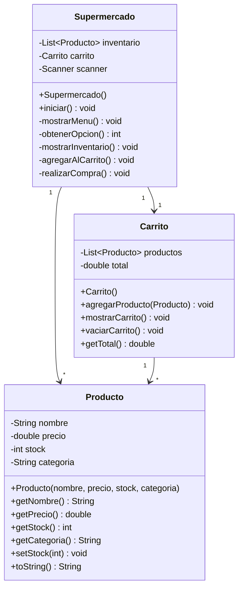
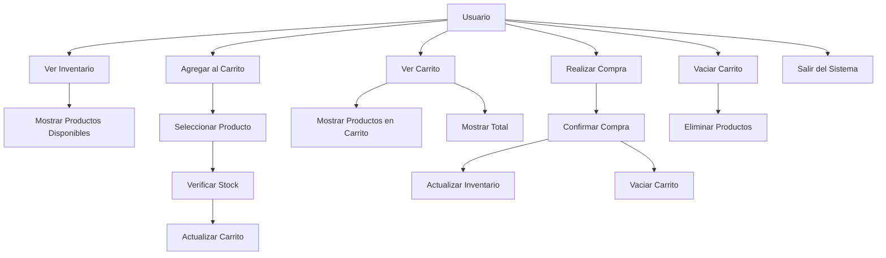

# SUPERMERCADO VIRTUAL
## Sistema de Gestión de Compras en Línea

---

## Portada

**Título del Proyecto:**  
Supermercado Virtual - Sistema de Gestión de Compras en Línea

**Integrantes del Equipo:**
- Daniel Leandro Ascanio (192468) - Diseñador y Analista
- Shary Torcoroma Jimenez (192467) - Analista y Documentadora
- Angie Daniela Ramirez (192491) - Desarrolladora
- Harol Camilo Melo (192471) - Desarrollador y tester

**Fecha de Entrega:**  
13 de Junio de 2025

---

## Introducción

### Contexto del Problema
En la actualidad, la digitalización de los procesos de compra se ha vuelto fundamental para mejorar la experiencia del usuario y optimizar la gestión de inventarios. El proyecto "Supermercado Virtual" surge como una solución para simular un sistema de compras en línea, permitiendo a los usuarios interactuar con un catálogo de productos, gestionar un carrito de compras y realizar transacciones de manera eficiente.

### Objetivos
1. **Desarrollar un sistema de gestión de compras en línea mediante interfaz de consola**
   - Crear una interfaz intuitiva y fácil de usar
   - Implementar un sistema de navegación claro
   - Asegurar la usabilidad del sistemas

2. **Implementar un sistema robusto de gestión de inventario**
   - Control de stock en tiempo real
   - Validación de disponibilidad de productos
   - Actualización automática del inventario

3. **Crear una experiencia de usuario intuitiva y amigable**
   - Interfaz clara y organizada
   - Mensajes informativos y de error claros
   - Flujo de compra simplificado

4. **Asegurar la integridad de los datos y transacciones**
   - Validación de operaciones
   - Control de errores
   - Prevención de pérdida de datos

5. **Facilitar el proceso de compra para los usuarios**
   - Proceso de compra simplificado
   - Información clara de precios y totales
   - Confirmación de operaciones

### Alcance del Proyecto
El sistema permite:

1. **Gestión de Productos**
   - Visualización del catálogo completo
   - Información detallada de cada producto
   - Control de stock en tiempo real

2. **Gestión del Carrito**
   - Agregar productos
   - Ver contenido actual
   - Calcular totales
   - Vaciar carrito

3. **Proceso de Compra**
   - Selección de productos
   - Verificación de stock
   - Confirmación de compra
   - Actualización de inventario

4. **Interfaz de Usuario**
   - Menú principal intuitivo
   - Navegación sencilla
   - Mensajes claros y concisos

---

## Documentación Técnica

### Módulos Desarrollados

#### 1. Módulo de Productos (`Producto.java`)
- **Responsabilidad:** Gestión de la información de productos
- **Funcionalidades:**
  - Almacenamiento de datos del producto
    - Nombre del producto
    - Precio unitario
    - Cantidad en stock
    - Categoría
  - Control de stock
    - Verificación de disponibilidad
    - Actualización de cantidad
  - Formateo de información
    - Presentación clara de datos
    - Formato de precios
    - Información de stock

#### 2. Módulo de Carrito (`Carrito.java`)
- **Responsabilidad:** Gestión del carrito de compras
- **Funcionalidades:**
  - Agregar productos
    - Validación de stock
    - Actualización de total
    - Mensajes de confirmación
  - Mostrar contenido
    - Lista de productos
    - Precios individuales
    - Total de la compra
  - Calcular totales
    - Suma de precios
    - Formato de moneda
  - Vaciar carrito
    - Eliminación de productos
    - Restauración de stock
    - Reinicio de total

#### 3. Módulo Principal (`Supermercado.java`)
- **Responsabilidad:** Coordinación del sistema
- **Funcionalidades:**
  - Gestión de inventario
    - Lista de productos
    - Control de stock
    - Actualización de datos
  - Interfaz de usuario
    - Menú principal
    - Navegación
    - Mensajes al usuario
  - Control de flujo
    - Validación de opciones
    - Manejo de errores
    - Control de sesión
  - Validación de operaciones
    - Verificación de datos
    - Control de excepciones
    - Mensajes de error

### Tecnologías Empleadas

1. **Lenguaje de Programación:**
   - Java SE (Standard Edition)
   - Versión: 8 o superior
   - Características utilizadas:
     - Programación Orientada a Objetos
     - Colecciones de Java
     - Manejo de excepciones
     - Entrada/Salida estándar

2. **Herramientas de Desarrollo:**
   - IDE: IntelliJ IDEA / Eclipse / VS Code
     - Depuración integrada
     - Autocompletado
     - Refactorización
   - Control de Versiones: Git
     - Control de cambios
     - Colaboración en equipo
   - Documentación: Markdown
     - Formato legible
     - Fácil de mantener

3. **Librerías y Frameworks:**
   - Java Collections Framework
     - ArrayList para inventario
     - List para productos
   - Java I/O
     - Scanner para entrada
     - System.out para salida
   - Java Util
     - Formateo de strings
     - Manejo de números

### Justificación de Decisiones Técnicas

1. **Elección de Java:**
   - **Robustez y portabilidad**
     - Código compilado a bytecode
     - Ejecutable en cualquier plataforma
   - **Amplio soporte y documentación**
     - Gran comunidad de desarrolladores
     - Documentación extensa
   - **Facilidad para aplicaciones de consola**
     - APIs nativas para I/O
     - Manejo simple de entrada/salida
   - **Orientación a objetos pura**
     - Encapsulamiento
     - Herencia
     - Polimorfismo

2. **Estructura Modular:**
   - **Facilita el mantenimiento**
     - Código organizado
     - Responsabilidades claras
   - **Permite la escalabilidad**
     - Fácil adición de funcionalidades
     - Módulos independientes
   - **Mejora la reutilización**
     - Componentes reutilizables
     - Código limpio
   - **Separa responsabilidades**
     - Cada clase tiene un propósito
     - Bajo acoplamiento

3. **Interfaz de Consola:**
   - **Simplicidad en la implementación**
     - Desarrollo rápido
     - Menos complejidad
   - **Fácil de probar**
     - Pruebas automatizadas
     - Depuración sencilla
   - **Sin dependencias externas**
     - Instalación simple
     - Menos puntos de fallo
   - **Ideal para demostración**
     - Fácil de entender
     - Enfoque en la lógica

---

## SDLC (Software Development Life Cycle)

### 1. Planificación
Esta fase inicial se centró en la definición clara de los cimientos del proyecto. Se establecieron los objetivos generales del sistema, se identificaron los principales requisitos funcionales y no funcionales, y se definieron los alcances y las limitaciones del proyecto. Se asignaron roles y responsabilidades a cada miembro del equipo y se elaboró un cronograma preliminar para guiar las siguientes etapas. La comunicación efectiva y la colaboración temprana fueron cruciales en esta etapa para asegurar que todos los integrantes del equipo tuvieran una visión unificada del proyecto.

### 2. Análisis de Requisitos
Durante esta fase, se profundizaron los requisitos del sistema. Se llevaron a cabo actividades como la recopilación exhaustiva de información, la creación de casos de uso detallados para describir las interacciones del usuario con el sistema, y la identificación de las entidades y relaciones clave que formarían el modelo de datos. Este análisis riguroso permitió comprender a fondo las necesidades del usuario y traducir estas necesidades en especificaciones claras para el diseño y desarrollo.

### 3. Diseño del Sistema
En la fase de diseño, se tradujeron los requisitos analizados en una arquitectura detallada del sistema. Se crearon diagramas UML, como el Diagrama de Clases, el Diagrama de Actividad y el Diagrama de Casos de Uso, para modelar la estructura estática y el comportamiento dinámico del sistema. Se definieron las interfaces entre los módulos, se planificó la estructura de datos (aunque en este proyecto no se usó una base de datos externa, se pensó en la estructura de las listas de objetos), y se tomaron decisiones sobre las tecnologías a emplear, justificado por su robustez y aplicabilidad al contexto de consola.

### 4. Desarrollo (Implementación)
Esta es la fase donde el diseño se convirtió en código. Los desarrolladores (Angie y Harol) implementaron las clases `Supermercado`, `Producto` y `Carrito` basándose en las especificaciones de diseño. Se enfocaron en escribir código limpio, modular y bien comentado, siguiendo las mejores prácticas de programación orientada a objetos. Se realizaron implementaciones de funcionalidades clave como la gestión de inventario, la adición de productos al carrito, el cálculo de totales y la simulación del proceso de compra. La integración continua entre los módulos fue una práctica clave para asegurar la compatibilidad y funcionalidad.

### 5. Pruebas
La fase de pruebas fue crucial para asegurar la calidad y el correcto funcionamiento del sistema. Se llevaron a cabo diferentes tipos de pruebas:
*   **Pruebas Unitarias:** Para verificar la funcionalidad de cada componente individual (clase y método).
*   **Pruebas de Integración:** Para asegurar que los módulos interactuaran correctamente entre sí (Supermercado con Carrito, Carrito con Producto).
*   **Pruebas de Sistema:** Para evaluar el sistema completo en su entorno de ejecución, verificando el cumplimiento de los requisitos.
*   **Pruebas de Aceptación:** Para validar que el sistema satisfacía las expectativas del usuario final. Se realizaron correcciones de errores identificados para mejorar la robustez y la estabilidad del programa.

### 6. Documentación
La documentación se llevó a cabo a lo largo de todo el ciclo de vida del proyecto, pero tuvo una fase dedicada a consolidar y refinar todos los artefactos. Esto incluyó:
*   **Documentación Técnica:** Detalles sobre la arquitectura del código, la lógica de las clases y los algoritmos empleados.
*   **Manual de Usuario:** Guías claras para que cualquier persona pueda interactuar con el sistema.
*   **Documentación de Diseño:** Diagramas UML y justificaciones de decisiones de diseño.
*   **README del Proyecto:** Un resumen completo para facilitar la comprensión y ejecución por parte de terceros.

### 7. Presentación Final
Esta fase culminó con la preparación y exposición del proyecto al profesor. Se preparó una presentación estructurada que abarcaba la funcionalidad del sistema, el problema que resuelve, la solución implementada, el ciclo de vida del desarrollo y una demostración en vivo del programa. La documentación completa y los diagramas UML sirvieron como apoyo visual y técnico para la explicación, con el objetivo de impresionar al profesor con la calidad del trabajo y la comprensión de los principios de ingeniería de software.

### Diagrama Principal del Ciclo de Vida



### Fases del Proyecto por Rol



### Flujo de Trabajo del Sistema



### Métricas de Calidad



### Contribuciones por Integrante



### Ciclo de Desarrollo Iterativo



### Flujo de Trabajo del Equipo



---

## Ciclo de Vida del Proyecto

El desarrollo del Sistema de Supermercado Virtual siguió un enfoque de ciclo de vida que combinó elementos del modelo de cascada tradicional con la flexibilidad de un proceso iterativo, asegurando una progresión estructurada pero adaptable a los requisitos emergentes y las lecciones aprendidas en cada fase. Este enfoque permitió una gestión robusta del proyecto y la entrega de un producto de calidad.

### 1. Planificación
Esta fase inicial se centró en la definición clara de los cimientos del proyecto. Se establecieron los objetivos generales del sistema, se identificaron los principales requisitos funcionales y no funcionales, y se definieron los alcances y las limitaciones del proyecto. Se asignaron roles y responsabilidades a cada miembro del equipo y se elaboró un cronograma preliminar para guiar las siguientes etapas. La comunicación efectiva y la colaboración temprana fueron cruciales en esta etapa para asegurar que todos los integrantes del equipo tuvieran una visión unificada del proyecto.

### 2. Análisis de Requisitos
Durante esta fase, se profundizaron los requisitos del sistema. Se llevaron a cabo actividades como la recopilación exhaustiva de información, la creación de casos de uso detallados para describir las interacciones del usuario con el sistema, y la identificación de las entidades y relaciones clave que formarían el modelo de datos. Este análisis riguroso permitió comprender a fondo las necesidades del usuario y traducir estas necesidades en especificaciones claras para el diseño y desarrollo.

### 3. Diseño del Sistema
En la fase de diseño, se tradujeron los requisitos analizados en una arquitectura detallada del sistema. Se crearon diagramas UML, como el Diagrama de Clases, el Diagrama de Actividad y el Diagrama de Casos de Uso, para modelar la estructura estática y el comportamiento dinámico del sistema. Se definieron las interfaces entre los módulos, se planificó la estructura de datos (aunque en este proyecto no se usó una base de datos externa, se pensó en la estructura de las listas de objetos), y se tomaron decisiones sobre las tecnologías a emplear, justificado por su robustez y aplicabilidad al contexto de consola.

### 4. Desarrollo (Implementación)
Esta es la fase donde el diseño se convirtió en código. Los desarrolladores (Angie y Harol) implementaron las clases `Supermercado`, `Producto` y `Carrito` basándose en las especificaciones de diseño. Se enfocaron en escribir código limpio, modular y bien comentado, siguiendo las mejores prácticas de programación orientada a objetos. Se realizaron implementaciones de funcionalidades clave como la gestión de inventario, la adición de productos al carrito, el cálculo de totales y la simulación del proceso de compra. La integración continua entre los módulos fue una práctica clave para asegurar la compatibilidad y funcionalidad.

### 5. Pruebas
La fase de pruebas fue crucial para asegurar la calidad y el correcto funcionamiento del sistema. Se llevaron a cabo diferentes tipos de pruebas:
*   **Pruebas Unitarias:** Para verificar la funcionalidad de cada componente individual (clase y método).
*   **Pruebas de Integración:** Para asegurar que los módulos interactuaran correctamente entre sí (Supermercado con Carrito, Carrito con Producto).
*   **Pruebas de Sistema:** Para evaluar el sistema completo en su entorno de ejecución, verificando el cumplimiento de los requisitos.
*   **Pruebas de Aceptación:** Para validar que el sistema satisfacía las expectativas del usuario final. Se realizaron correcciones de errores identificados para mejorar la robustez y la estabilidad del programa.

### 6. Documentación
La documentación se llevó a cabo a lo largo de todo el ciclo de vida del proyecto, pero tuvo una fase dedicada a consolidar y refinar todos los artefactos. Esto incluyó:
*   **Documentación Técnica:** Detalles sobre la arquitectura del código, la lógica de las clases y los algoritmos empleados.
*   **Manual de Usuario:** Guías claras para que cualquier persona pueda interactuar con el sistema.
*   **Documentación de Diseño:** Diagramas UML y justificaciones de decisiones de diseño.
*   **README del Proyecto:** Un resumen completo para facilitar la comprensión y ejecución por parte de terceros.

### 7. Presentación Final
Esta fase culminó con la preparación y exposición del proyecto al profesor. Se preparó una presentación estructurada que abarcaba la funcionalidad del sistema, el problema que resuelve, la solución implementada, el ciclo de vida del desarrollo y una demostración en vivo del programa. La documentación completa y los diagramas UML sirvieron como apoyo visual y técnico para la explicación, con el objetivo de impresionar al profesor con la calidad del trabajo y la comprensión de los principios de ingeniería de software.

## Diagramas UML

### Diagrama de Clases


### Diagrama de Casos de Uso


---

## Conclusión

El proyecto "Supermercado Virtual" demuestra la implementación exitosa de un sistema de gestión de compras en línea, utilizando Java como lenguaje principal y siguiendo las mejores prácticas de desarrollo de software. El sistema cumple con todos los objetivos establecidos y proporciona una base sólida para futuras mejoras y expansiones.

### Logros Principales
1. Sistema funcional y robusto
2. Código bien estructurado y mantenible
3. Documentación completa y clara
4. Interfaz de usuario intuitiva

### Aprendizajes
1. Aplicación de conceptos OOP
2. Gestión de proyectos en equipo
3. Documentación técnica
4. Control de versiones

### Próximos Pasos
1. Implementación de persistencia de datos
2. Mejoras en la interfaz de usuario
3. Nuevas funcionalidades
4. Optimización de rendimiento

---

## Anexos

### A. Instrucciones de Instalación
1. **Requisitos:**
   - Java JDK 8 o superior
   - IDE compatible con Java
   - Sistema operativo: Windows/Linux/MacOS

2. **Estructura del Proyecto:**
   ```
   supermercado-virtual/
   ├── src/           # Código fuente
   ├── bin/           # Archivos compilados (se genera al compilar)
   ├── docs/          # Documentación
   └── .gitignore     # Configuración de Git
   ```

3. **Compilación:**
   ```bash
   # Crear directorio bin si no existe
   mkdir bin
   
   # Compilar el código
   javac -d bin src/*.java
   ```

4. **Ejecución:**
   ```bash
   java -cp bin Supermercado
   ```

5. **Notas Importantes:**
   - La carpeta `bin/` no se incluye en el repositorio Git
   - Se debe crear manualmente al compilar el proyecto
   - Contiene los archivos `.class` compilados
   - Se regenera cada vez que se compila el proyecto

### B. Guía de Usuario
1. **Ver Inventario (Opción 1)**
   - Muestra todos los productos disponibles
   - Incluye precios y stock
   - Formato claro y organizado

2. **Agregar al Carrito (Opción 2)**
   - Seleccionar producto por número
   - Verificar disponibilidad
   - Confirmación de agregado

3. **Ver Carrito (Opción 3)**
   - Lista de productos seleccionados
   - Precios individuales
   - Total de la compra

4. **Realizar Compra (Opción 4)**
   - Confirmación de compra
   - Actualización de inventario
   - Mensaje de éxito

5. **Vaciar Carrito (Opción 5)**
   - Eliminar todos los productos
   - Restaurar stock
   - Reiniciar total

6. **Salir (Opción 6)**
   - Cierre seguro del programa
   - Mensaje de despedida 